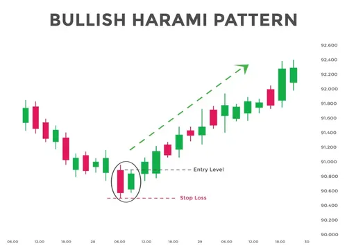

# Multiple Candlestick Patterns (Part 2)

## 1. The Harami Pattern (Meaning: "Pregnant" in Japanese)
*   **Definition:** A two-candlestick pattern where P2 (small candle) appears "tucked inside" or "pregnant" within the body of P1 (long candle).
*   **Structure:** P1 = Long candle, P2 = Small candle (opposite color).
*   **Key Difference from Engulfing:** In Harami, P2 is **contained within P1**. In Engulfing, P2 **covers P1**.[1]

***

## 2. Bullish Harami (Buy Signal)
*   **Location:** Bottom of a **Downtrend**.
*   **Structure:**
    *   **P1:** Long **Red** candle (Bears in control, new low).
    *   **P2:** Small **Blue** candle (P2 body contained within P1 body).
*   **Validation Conditions (Risk-Taker at 3:20 PM on P2):**
    1. P2 Open > P1 Close (Gap up opening surprises bears).
    2. P2 CMP < P1 Open (P2 closes below P1 open).
*   **Psychology:** Bears expect lower open on P2, but gap up + Blue candle creates panic. Bulls make sudden entry in bear stronghold.[1]
*   **Action:** **Buy (Long)**
*   **Stoploss (SL):** **Lowest Low** between P1 and P2.
*   **Entry:**
    *   *Risk-Taker:* Buy at P2 close (~835 in Axis Bank example).
    *   *Risk-Averse:* Buy on Day 3 after Blue candle confirmation.[1]

***

## 3. Bearish Harami (Sell Signal)
*   **Location:** Top of an **Uptrend**.
*   **Structure:**
    *   **P1:** Long **Blue** candle (Bulls in control, new high).
    *   **P2:** Small **Red** candle (P2 body contained within P1 body).
*   **Validation Conditions (Risk-Taker at 3:20 PM on P2):**
    1. P2 Open < P1 Close (Gap down opening surprises bulls).
    2. P2 Close > P1 Open (P2 closes above P1 open).
*   **Psychology:** Bulls expect higher open on P2, but gap down + Red candle causes panic. Bears make sudden entry.[1]
*   **Action:** **Sell (Short)**
*   **Stoploss (SL):** **Highest High** between P1 and P2.
*   **Entry:**
    *   *Risk-Taker:* Short at P2 close.
    *   *Risk-Averse:* Short on Day 3 after Red candle confirmation.[1]

***

## Quick Revision Summary Table

| Pattern | Prior Trend | P1 Candle | P2 Candle | Action | SL |
| :--- | :--- | :--- | :--- | :--- | :--- |
| **Bullish Harami** | Down $\downarrow$ | Long **Red** | Small **Blue** (inside P1) | **Buy** | Lowest Low (P1+P2) |
| **Bearish Harami** | Up $\uparrow$ | Long **Blue** | Small **Red** (inside P1) | **Sell** | Highest High (P1+P2) |

---

## Key Differences: Harami vs Engulfing

| Feature | **Harami** | **Engulfing** |
| :--- | :--- | :--- |
| **P2 vs P1 Relationship** | P2 **contained within** P1 | P2 **covers/engulfs** P1 |
| **Strength** | Moderate reversal signal | Stronger reversal signal |
| **Psychology** | Surprise entry (gap) + small push | Aggressive takeover |

**Visual Memory:** Harami = **"Baby inside mother"** (P2 inside P1). Engulfing = **"Monster eats previous candle"** (P2 eats P1).[1]

**Common Mistakes to Avoid:**
- No prior trend = Not a valid Harami.
- P2 not contained within P1 = Not Harami (might be Engulfing).
- Flat trend = Ignore the pattern.[1]

## Sources
[9. Multiple candlestick patterns (Part 2)](https://zerodha.com/varsity/chapter/multiple-candlestick-patterns-part-2/)