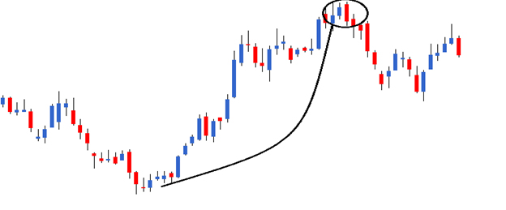
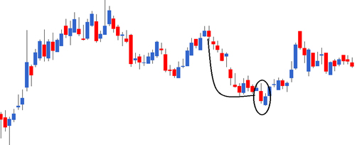
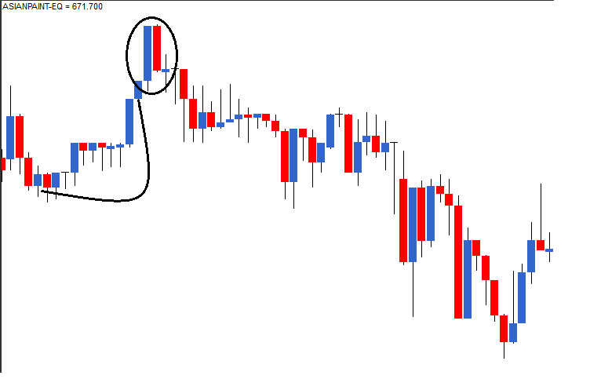
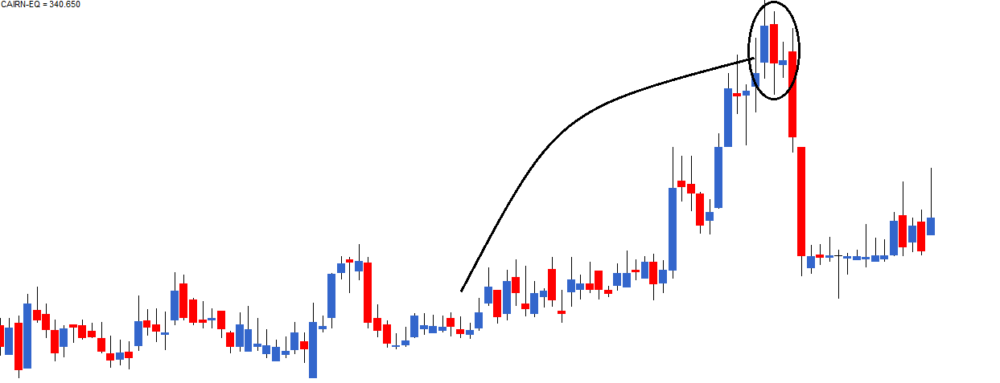

# Multiple Candlestick Patterns - Engulfing, Piercing and Dark Cloud Cover patterns.

## 1. The Engulfing Pattern (General)
*   **Definition:** A two-candlestick pattern that evolves over two trading sessions (P1 and P2).
*   **Core Concept:** The real body of the second candle (P2) completely covers (engulfs) the real body of the first candle (P1).
*   **Shadows:** While purists look for shadows to be engulfed, engulfing just the **real body** is sufficient for trading.[1]

***

## 2. Bullish Engulfing Pattern (Buy Signal)
*   **Location:** Bottom of a **Downtrend**.
*   **Structure:**
    *   **P1:** Red candle (Bears in control).
    *   **P2:** Blue/Green candle (Bulls take over).
    *   **Rule:** P2's Blue body must completely engulf P1's Red body.
*   **Psychology:** Bears push prices lower on P1. On P2, price opens lower but sudden buying pressure drives it to close higher than P1's open, rattling the bears.[1]
*   **Action:** **Buy (Long)**
*   **Stoploss (SL):** The **Lowest Low** between P1 and P2.
*   **Entry:**
    *   *Risk-Taker:* Buy on P2 closing (around 3:20 PM) after validating engulfing.
    *   *Risk-Averse:* Buy on Day 3 (day after P2) after confirming a Blue candle forms.[1]

***

## 3. Bearish Engulfing Pattern (Sell Signal)
*   **Location:** Top of an **Uptrend**.
*   **Structure:**
    *   **P1:** Blue/Green candle (Bulls in control).
    *   **P2:** Red candle (Bears take over).
    *   **Rule:** P2's Red body must completely engulf P1's Blue body.
*   **Psychology:** Bulls push new highs on P1. On P2, price opens higher but sudden selling pressure forces it to close below P1's open, displacing the bulls.[1]
*   **Action:** **Sell (Short)**
*   **Stoploss (SL):** The **Highest High** between P1 and P2.
*   **Entry:**
    *   *Risk-Taker:* Short on P2 closing (around 3:20 PM) after validating engulfing.
    *   *Risk-Averse:* Short on Day 3 (day after P2) after confirming a Red candle forms.[1]

---

## 4. The Piercing Pattern (Bullish)
*   **Concept:** Similar to Bullish Engulfing but with **partial** engulfing.
*   **Location:** Bottom of a Downtrend.
*   **Structure:**
    *   **P1:** Red Candle.
    *   **P2:** Blue Candle.
    *   **Rule:** P2's Blue body engulfs between **50% and 100%** of P1's Red body.
    *   *Note:* If it covers < 50%, it is **not** a Piercing Pattern. If it covers > 100%, it is Bullish Engulfing.[1]
*   **Preference:** The Bullish Engulfing is a stronger signal than the Piercing Pattern.

***

## 5. Dark Cloud Cover (Bearish)
*   **Concept:** Similar to Bearish Engulfing but with **partial** engulfing.
*   **Location:** Top of an Uptrend.
*   **Structure:**
    *   **P1:** Blue Candle.
    *   **P2:** Red Candle.
    *   **Rule:** P2's Red body engulfs between **50% and 100%** of P1's Blue body.
*   **Preference:** The Bearish Engulfing is a stronger signal than Dark Cloud Cover.[1]

***

## 6. The "Doji" Catalyst
*   **Observation:** If a **Doji** appears immediately after an engulfing pattern (on Day 3), it often catalyzes the move.
*   **Example:** Uptrend $\rightarrow$ Bearish Engulfing $\rightarrow$ Doji.
    *   The Doji indicates indecision/uncertainty following the panic of the engulfing pattern. This "Panic + Uncertainty" recipe often leads to a strong price drop.[1]

***

## Quick Revision Summary Table

| Pattern | Prior Trend | P1 Color | P2 Color | Engulfing Extent | Action | SL |
| :--- | :--- | :--- | :--- | :--- | :--- | :--- |
| **Bullish Engulfing** | Down $\downarrow$ | Red | Blue | 100% | Buy | Lowest Low |
| **Piercing Pattern** | Down $\downarrow$ | Red | Blue | 50% - <100% | Buy | Low of Pattern |
| **Bearish Engulfing** | Up $\uparrow$ | Blue | Red | 100% | Sell | Highest High |
| **Dark Cloud Cover** | Up $\uparrow$ | Blue | Red | 50% - <100% | Sell | High of Pattern |

## Sources
[1] [Multiple candlestick patterns (Part 1)](https://zerodha.com/varsity/chapter/multiple-candlestick-patterns-part-1/)