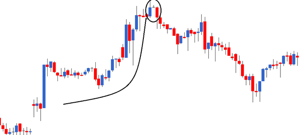

# Multiple Candlestick Patterns (Part 3)

### 1. Prerequisite: Understanding Gaps
Before identifying Star patterns, you must understand Gaps. A gap occurs when the opening price of a day is significantly different from the previous day's closing price.

*   **Gap Up:** Open > Previous Close.
    *   *Meaning:* Buyer’s enthusiasm. Buyers are willing to pay a premium.
    *   *Sentiment:* **Bullish**.[1]
*   **Gap Down:** Open < Previous Close.
    *   *Meaning:* Seller’s enthusiasm. Sellers are desperate to unload stock.
    *   *Sentiment:* **Bearish**.[1]

***

### 2. The Morning Star (Bullish Reversal)
A 3-candle pattern that appears at the **bottom of a downtrend**.

*   **Structure:**
    *   **P1 (Day 1):** Long **Red** Candle (Bears in absolute control; new low).
    *   **P2 (Day 2):** **Gap Down** opening + **Doji/Spinning Top**.
        *   *Note:* The color of P2 does not matter. The gap down confirms bearishness, but the small body indicates **indecision** and nervousness among bears.[1]
    *   **P3 (Day 3):** **Gap Up** opening + **Blue** Candle.
        *   *Rule:* P3 must close **above** P1's opening price.
*   **Psychology:** Bears push price down (P1) $\rightarrow$ Bears get nervous/market pauses (P2) $\rightarrow$ Bulls seize control on gap up and recover losses (P3).
*   **Action:** **Buy (Long)**.
*   **Stoploss (SL):** The **Lowest Low** of the entire pattern (usually P2's low).

***

### 3. The Evening Star (Bearish Reversal)
A 3-candle pattern that appears at the **top of an uptrend**.

*   **Structure:**
    *   **P1 (Day 1):** Long **Blue** Candle (Bulls in absolute control; new high).
    *   **P2 (Day 2):** **Gap Up** opening + **Doji/Spinning Top**.
        *   *Note:* The gap up confirms bullishness, but the small body indicates **indecision** and panic among bulls.[1]
    *   **P3 (Day 3):** **Gap Down** opening + **Red** Candle.
        *   *Rule:* P3 must close **below** P1's opening price.
*   **Psychology:** Bulls push price up (P1) $\rightarrow$ Bulls get nervous/market pauses (P2) $\rightarrow$ Bears seize control on gap down and push prices deep (P3).
*   **Action:** **Sell (Short)**.
*   **Stoploss (SL):** The **Highest High** of the entire pattern (usually P2's high).[1]

***

### 4. Morning vs. Evening Star: Quick Comparison

| Feature | Morning Star | Evening Star |
| :--- | :--- | :--- |
| **Trend** | Downtrend $\downarrow$ | Uptrend $\uparrow$ |
| **Signal** | Bullish Reversal | Bearish Reversal |
| **P1** | Long Red | Long Blue |
| **P2 (The Star)** | Gap **Down** Doji/Spinning Top | Gap **Up** Doji/Spinning Top |
| **P3** | Gap **Up** Blue | Gap **Down** Red |
| **Action** | **Buy** at P3 Close | **Sell** at P3 Close |
| **Stoploss** | Lowest Low | Highest High |

***

### 5. General Trading Rules (Entry & SL)

*   **Entry Rule (Risk Taker vs. Risk Averse):**
    *   **Risk Taker:** Enters around **3:20 PM on the last day** of the pattern (P3) after validating the rules.
    *   **Risk Averse:** Usually waits for the *next* day for confirmation (e.g., a blue candle following a Morning Star).
    *   **The "3-Day" Exception:** Since Star patterns evolve over 3 days, they are considered strong signals. Therefore, **both Risk Takers and Risk Averse traders can initiate the trade on P3 itself** (Day 3) without waiting for Day 4.[1]

*   **Rule of Thumb:** The higher the number of days involved in a pattern, the safer it is to initiate the trade on the same day (Day of completion).[1]

*   **Stoploss Summary:**
    *   **Long Trade:** Lowest Low of the pattern.
    *   **Short Trade:** Highest High of the pattern.

### 6. The "Philosophy" of Candlesticks
*   **Don't Memorize, Understand:** You don't need to memorize every single pattern. Focus on the **thought process** (Who is in control? Bulls or Bears?).
*   **Adaptability:** Once you understand the logic (Price Action), you can react to any chart, even if it doesn't fit a textbook pattern exactly.[1]

## Sources
[1] [Multiple Candlestick Patterns (Part 3)](https://zerodha.com/varsity/chapter/multiple-candlestick-patterns-part-3/)